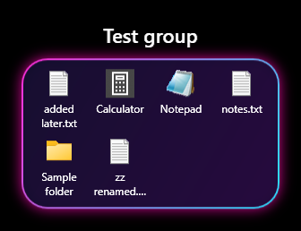
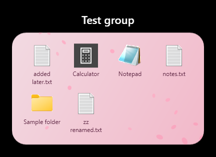
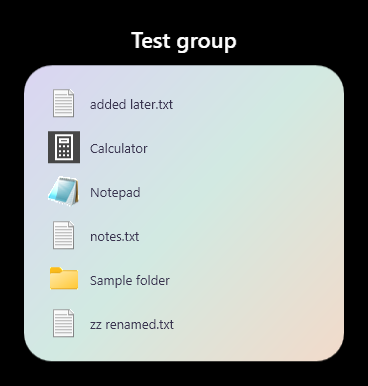

# DesktopGroups

iPhone-style folders for the Windows desktop. A group is a normal desktop icon whose tile shows mini icons of what's inside. Double-click it and its contents open in a panel next to the icon.

<p>
  
  
  
</p>

## What it does

- **Groups are real desktop icons.** Explorer arranges and sorts them like any other shortcut, and they stay put with Win+D.
- **Live tile icons.** Each group's icon shows up to nine of its items and updates when the contents change.
- **Panels open beside the icon.** Double-click an item to open it. Click anywhere else, or press Alt+Tab, to close the panel.
- **Drag and drop both ways.** Drop files onto a group's icon or its open panel to move them in. Drag items out of the panel to put them back on the desktop or into a folder.
- **Themes and layout per group.** Neon Tokyo, Sakura, Pastel, Light, Dark, Frosted glass, any tint color, or your own picture with adjustable dim. Optional falling petals or sparkles. Icon size, grid or list, spacing, corner roundness, name position, and which side of the icon the panel opens on.
- **Stays out of the way.** It runs in the background, with no window or tray icon.

## Install

1. Install the [.NET 8 Desktop Runtime](https://dotnet.microsoft.com/download/dotnet/8.0) (x64) if you don't have it.
2. Download `DesktopGroups-1.0.0-win-x64.zip` from [Releases](https://github.com/lilcham1/DesktopGroups/releases/latest).
3. Unzip it to a folder **outside** `AppData`, for example `C:\Apps\DesktopGroups`. On some PCs, Explorer won't show icons stored under `AppData`.
4. Run `DesktopGroups.exe`.

Running it again while it's already running opens the **New group** dialog.

## Use

- **New group:** right-click the desktop → **New** → **Desktop group**. Or run `DesktopGroups.exe` again.
- **Add items:** drop files onto the group's icon or its open panel.
- **Settings:** open a group, right-click inside the panel → **Settings…**. Theme, layout, where the panel opens, rename, and delete.
- **Rename:** double-click the name above the panel.
- **Delete a group:** in Settings or the right-click menu. Its items go back to your desktop first.
- **Start with Windows** and **Quit** are in the panel's right-click menu.

Group contents live in `%AppData%\DesktopGroups\<group>\`, and styles in `%AppData%\DesktopGroups\groups.json`.

## Build from source

Requires the .NET 8 SDK on Windows.

```
dotnet build
```

`install.ps1` publishes a Release build to `F:\Apps\DesktopGroups` (pass `-InstallDir` to change it), sets it to start with Windows, and starts it.

Tested on Windows 11 24H2 and later.
